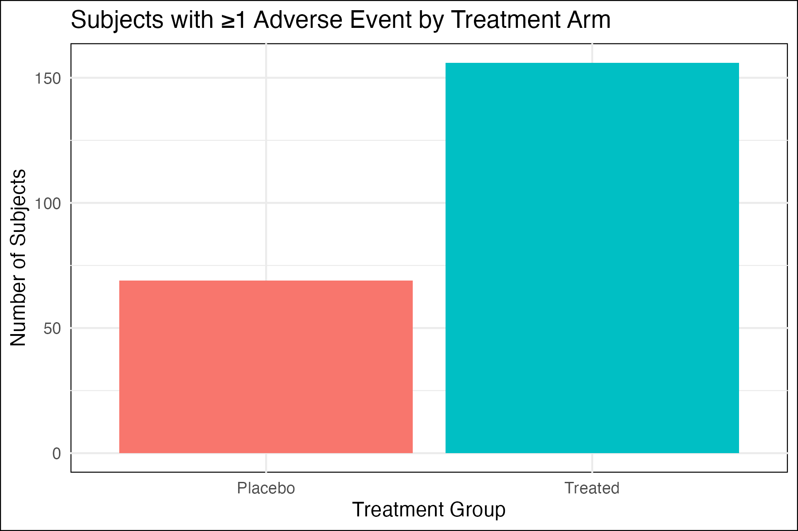
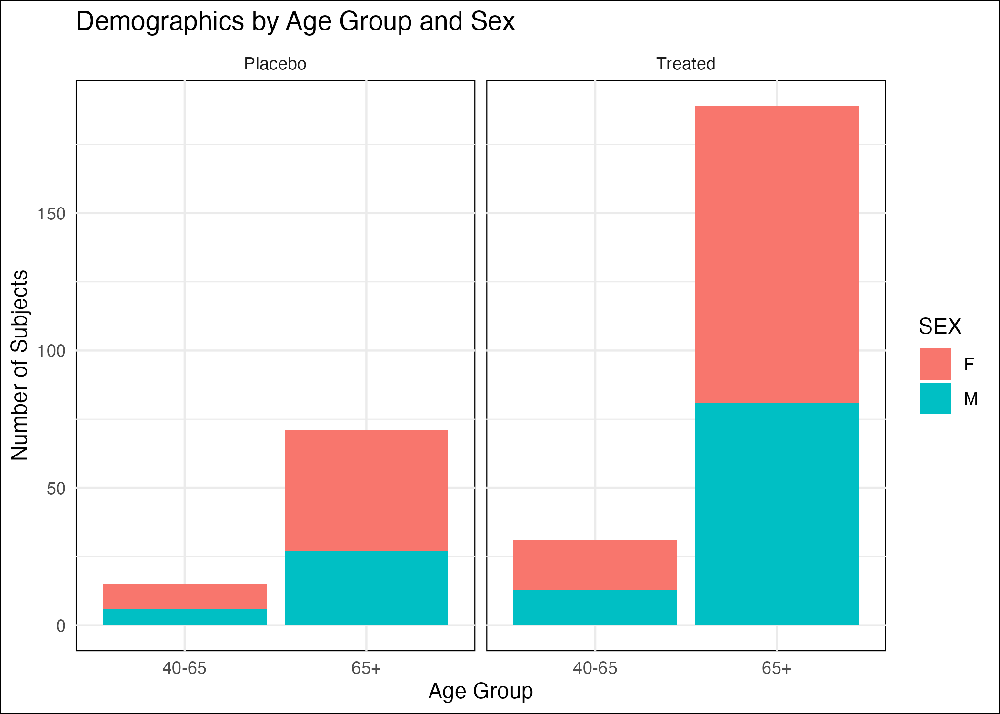

# SDTM & ADaM Clinical Data Portfolio Project

## Overview
This project showcases my ability to work with **clinical trial datasets** using the **CDISC SDTM and ADaM standards**, which are required by regulatory agencies like the FDA and EMA.  
The goal was to take public CDISC Pilot Study data, process it into **analysis-ready datasets (ADaM)**, and generate **tables, listings, and figures (TLFs)** similar to what is used in regulatory submissions and clinical study reports.

While this is a learning and portfolio project (not tied to an actual submission), it follows **industry-standard steps** that a clinical programmer or biostatistician would use on a real study.

---

## What I Did
1. **Imported CDISC Pilot SDTM Data**  
   Used the `admiral.test` package to pull standardized **Demographics (DM)**, **Adverse Events (AE)**, and **Lab Results (LB)** datasets.

2. **Created ADaM Datasets**
   - **ADSL**: Subject-level dataset derived from DM, with **age groups and treatment flags**.
   - **ADAE**: Adverse event dataset created by combining AE data with subject-level attributes (treatment, age group, study start date) and deriving **treatment-emergent AE flags**.

3. **Generated Recruiter-Friendly Outputs**
   - **AE Summary**: Count of subjects with ≥1 AE by treatment arm (table + bar chart).
   - **Demographics Summary**: Age and sex distribution by treatment group (table + stacked bar chart).

4. **Automated the Pipeline**
   - Built modular scripts for each step.
   - Created a `run_all.R` script so the entire process can be run in one command.

---

## Why This Matters
Clinical programming roles (and data science roles in pharma) require understanding how to:
- Work with **SDTM and ADaM datasets**,
- **Derive analysis variables** (e.g., age groups, treatment-emergent flags),
- Produce **summary outputs** for regulatory or internal reports.

This project demonstrates those skills in a **shareable, open-source format** using R (the most common open-source tool for this work), while keeping the pipeline flexible for Python.

---

## Project Structure
```
SDTM_ADaM_Portfolio/
├── README.md                     # Project documentation
│
├── raw_data/                     # CDISC Pilot SDTM datasets
│   ├── dm.csv                    # Demographics (SDTM DM)
│   ├── ae.csv                    # Adverse Events (SDTM AE)
│   └── lb.csv                    # Lab Results (SDTM LB)
│
├── adam/                         # ADaM datasets (analysis-ready)
│   ├── adsl.csv                  # Subject-level dataset (ADSL)
│   └── adae.csv                  # Adverse events dataset (ADAE)
│
├── tlf/                          # Recruiter-facing outputs
│   ├── ae_summary_by_treatment.csv  # AE summary table (by treatment)
│   ├── ae_summary_plot.png          # AE summary bar chart
│   ├── demographics_summary.csv     # Demographics table (age group, sex, treatment)
│   └── demographics_plot.png        # Demographics stacked bar chart
│
└── scripts/                      # Modular R scripts
    ├── 00_get_data.R             # Pull SDTM Pilot Study data (via admiral.test)
    ├── 01_prepare_adsl.R         # Create ADSL (subject-level analysis dataset)
    ├── 02_prepare_adae.R         # Create ADAE (adverse events analysis dataset)
    ├── 03_summary_adae.R         # Generate AE summary table + chart
    ├── 04_summary_adsl.R         # Generate demographics summary table + chart
    └── run_all.R                 # Run full pipeline in one command
```

---

## Quick Visuals (Key Outputs)

### AE Summary (Subjects with ≥1 Adverse Event by Treatment Arm)


---

### Demographics Breakdown (Age Groups & Sex by Treatment Arm)



---

## How to Run
From the project root in R:
```r
source("scripts/run_all.R")
```

Or from the Mac terminal:
```bash
Rscript scripts/run_all.R
```

This will:
- Download the **CDISC Pilot Study SDTM datasets**,
- Create the **ADSL** and **ADAE** analysis datasets,
- Generate **summary tables and charts** in the `tlf/` folder.

---

## Outputs
After running the pipeline, you’ll find:
- `adam/adsl.csv` – Subject-level ADaM dataset  
- `adam/adae.csv` – Adverse events ADaM dataset  
- `tlf/ae_summary_by_treatment.csv` – Table: Subjects with ≥1 AE by treatment arm  
- `tlf/ae_summary_plot.png` – Bar chart: AE summary  
- `tlf/demographics_summary.csv` – Table: Age and sex breakdown by treatment  
- `tlf/demographics_plot.png` – Stacked bar chart: Demographics by age and sex  

---

## Notes
- Uses **CDISC Pilot Study data** (fictional but realistic) from the `admiral.test` package.  
- Focuses on **ADaM derivation (ADSL, ADAE)** and **recruiter-facing outputs**.  
- R is the **primary workflow**; Python equivalents can be added if needed.
